#### 模仿云购电商项目

> umi + dva + typescript  前台umi全家桶

> ant design pro   基于蚂蚁金服后台管理开发

> 基于阿里开源Nodejs框架 eggjs + jwt + redis + mysql 开发接口, 图片存储于 七牛云平台

> 部署服务器采用 docker的redis集群, 后续 准备采用 微服务架构

> 订单的消息队列采用zeromq.node 

**运行**

`npm install`

`npm start`

**联系作者**

> QQ: 1540907804

> 邮箱: tongtao525@163.com

**微信:**

**效果预览前台**

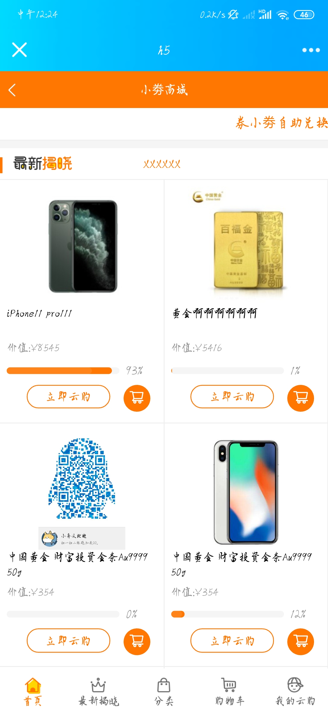 
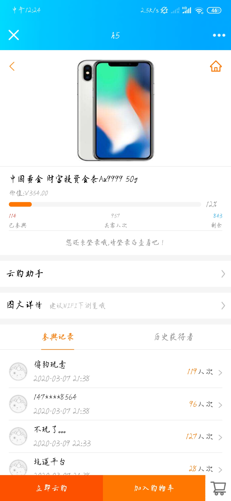 
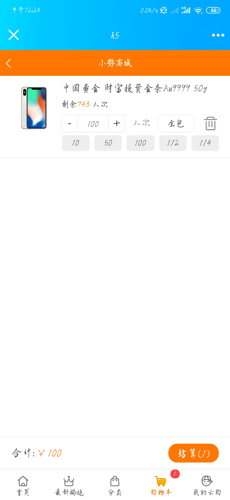 
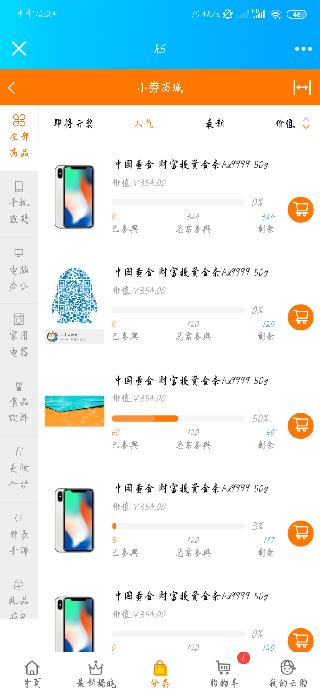 
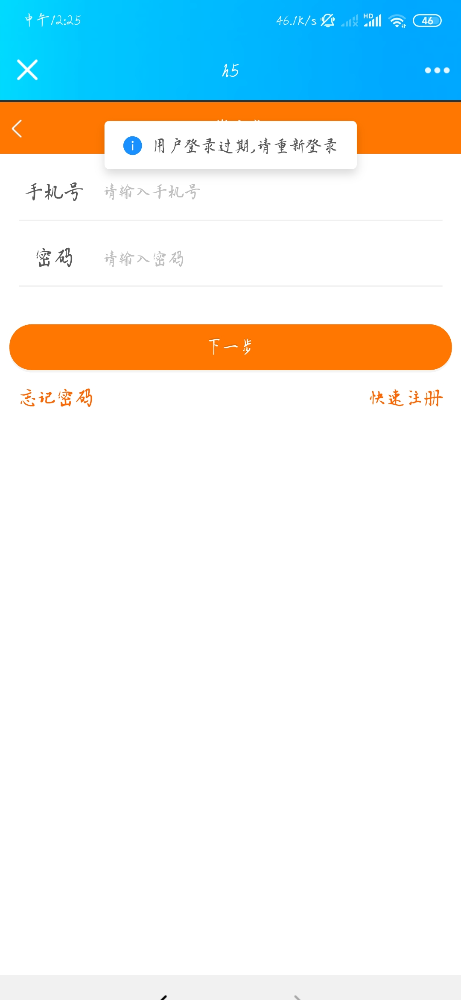 
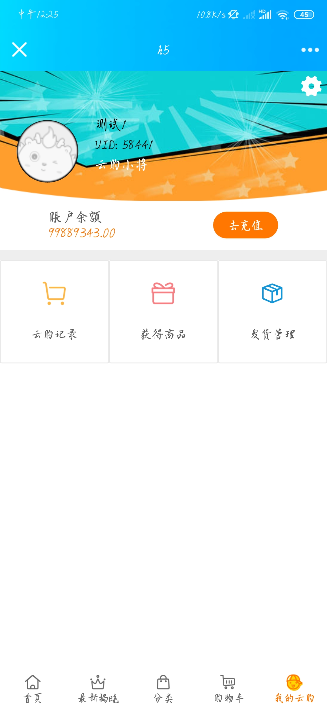 
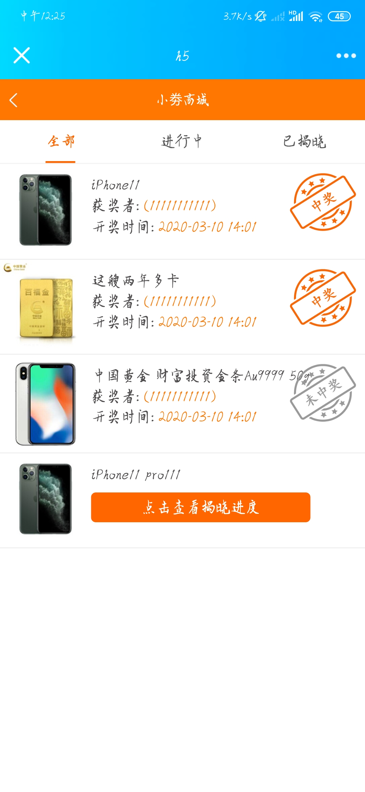 
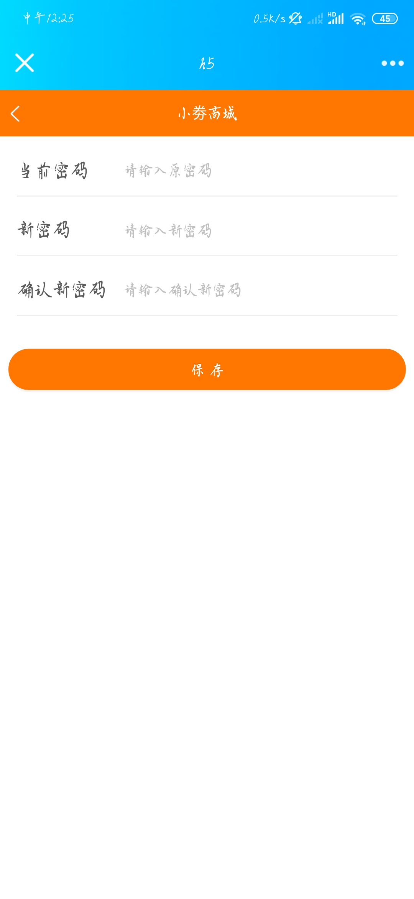 
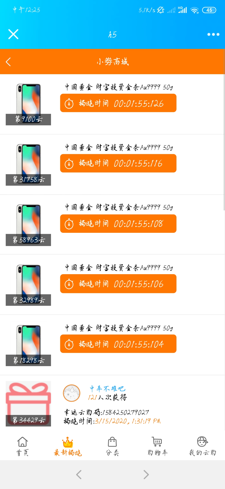 
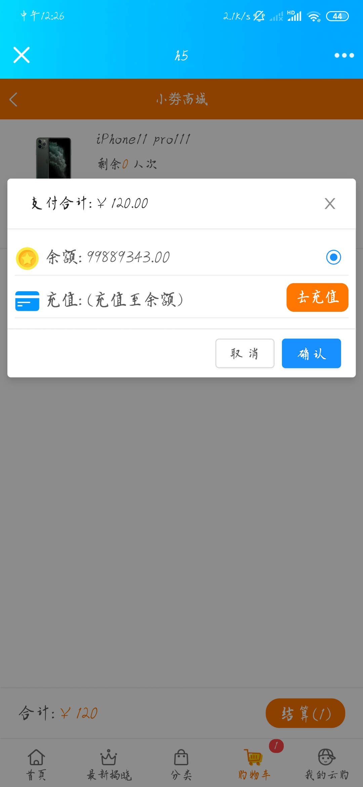 
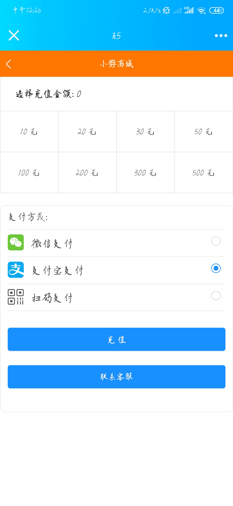 

**效果预览后台台**

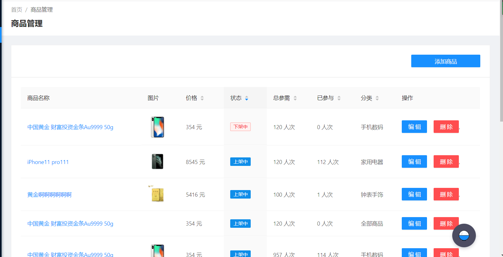
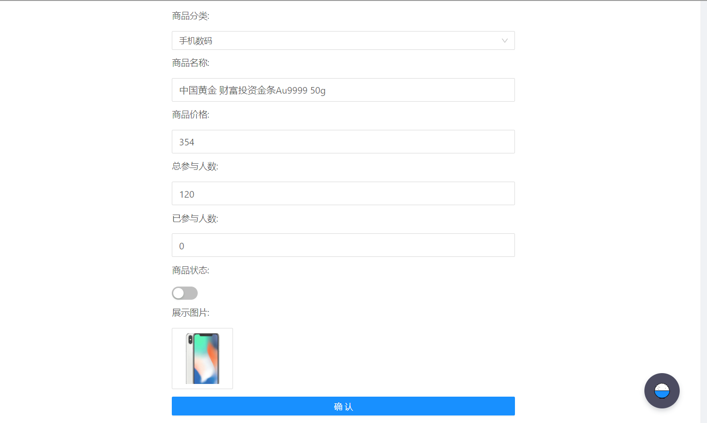
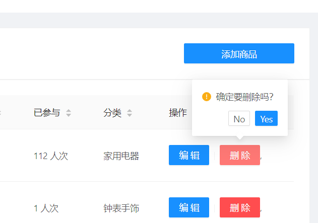
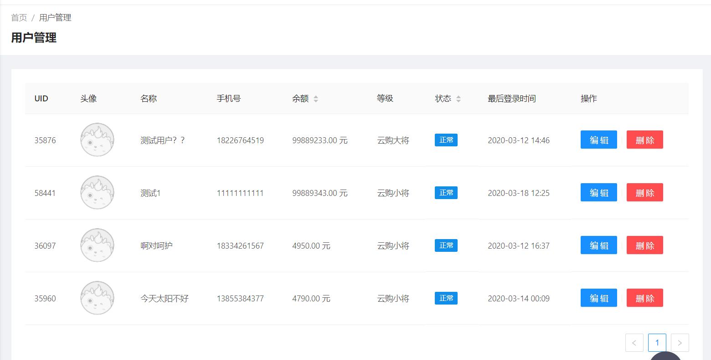
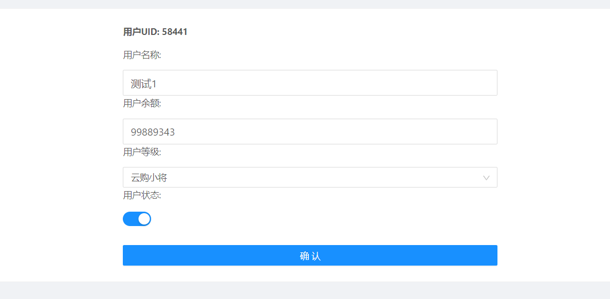
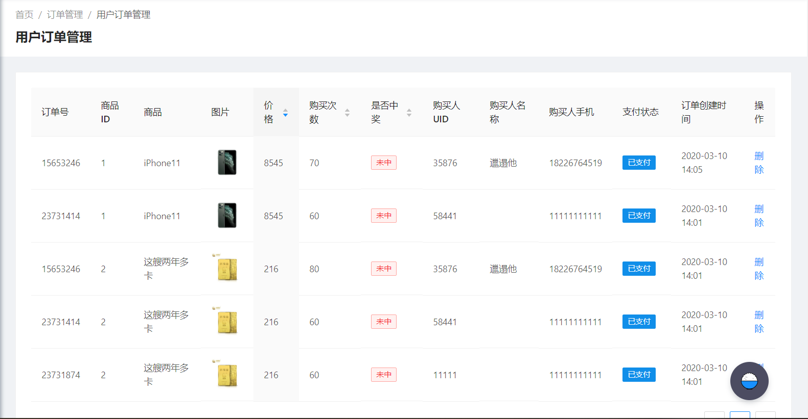
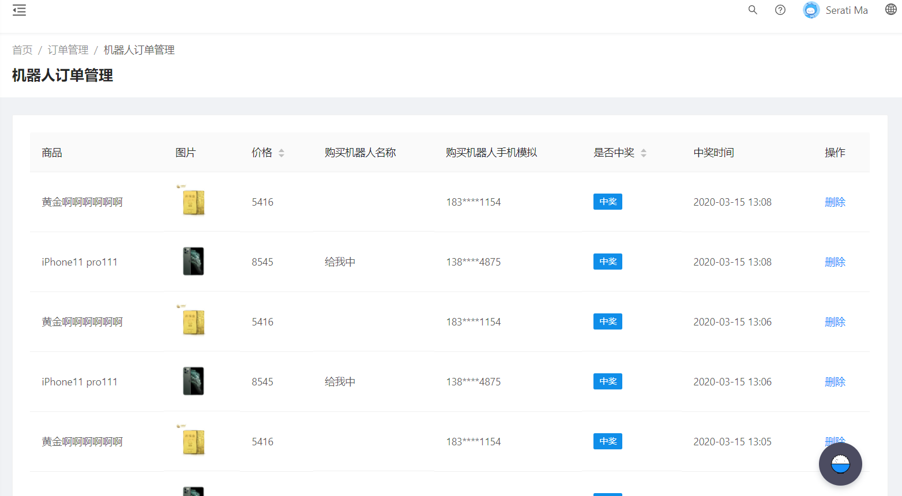
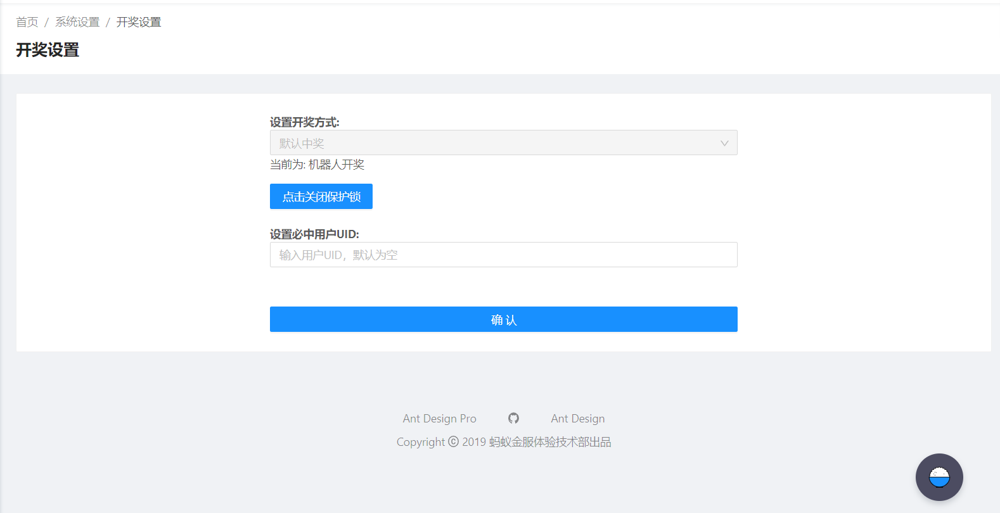
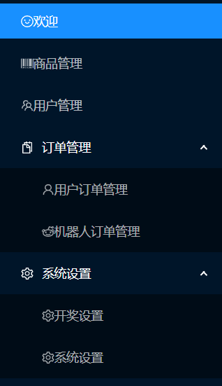

> 项目中如遇同名等巧合联系我更改，谢谢。另外觉得不错的话 麻烦哥哥姐姐 给个星星星星 哦